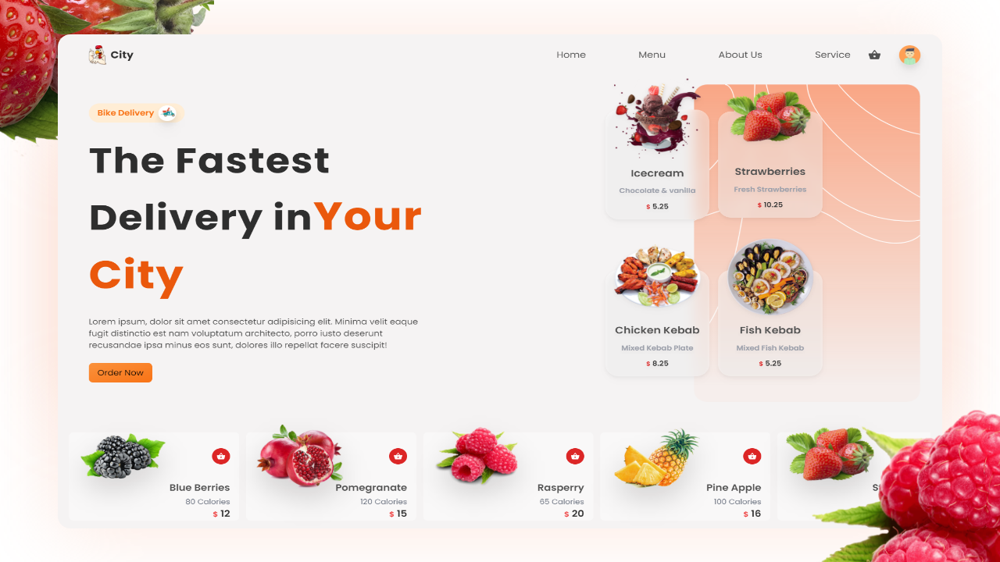

> FarmU is a serverless Ecommerce application based out on MERN stack!


<>


# FarmU: New-age E-commerce Application for Farmers


Welcome to the official repository of **FarmU**, an innovative platform that revolutionizes the way job seekers connect with employers. Our cutting-edge technology simplifies and enhances the hiring process, making it more efficient and user-focused.

## Table of Contents

- [Introduction](#introduction)
- [Features](#features)
- [Tech Stack](#tech-stack)
- [Usage](#usage)
- [Screenshots](#screenshots)
- [Future Enhancements](#future-enhancements)
- [Usage](#usage)
- [Instructions](#instructions)
- [Contributors](#contributors)
- [License](#license)

## Introduction

FarmU is an E-commerce platform that connects consumers with locally grown, high-quality fruits and vegetables. We believe in promoting healthy living and supporting local farmers, ensuring that you get the freshest produce while contributing to the sustainability of local agriculture.


## Features

- User-friendly browsing and shopping experience
- Wide variety of fresh fruits and vegetables
- Detailed product listings with images, descriptions, and prices
- Secure online payment options
- User accounts for order history and tracking
- Responsive design for mobile and desktop access

## Tech Stack

- **Frontend**: React 
- **Backend**: Express, Node.js 
- **Cloud Platform**: Firebase 
- **Assistant Chatbot**: React Chatbot 
- **Payment Integration**: Stripe 
- **UI Framework**: TailwindCSS 


## Screenshots

### User


*Homepage showcasing the variety of fresh produce.*


*Detailed view of a product listing.*


*Assistant chatbot generating useful stuff.*

### Admin Dashboard

*List of products displayed to the Users*


*CRUD features on different products*

## Usage

1. Visit [FarmU](https://farm-u.vercel.app/) on the web or run it locally.
2. Browse through the collection of fresh fruits and vegetables.
3. Add products to your cart and proceed to checkout.
4. Enter shipping and payment information.
5. Place your order and receive a freshness at your doorstep.

# Instructions 

## To check the node Version

```
node --version
```

## To initialize the Firebase console

```
firebase init
```

## To start the server

```
npm run serve
```

## To create react project using npm & yarn

```
npm create-react-app folder_name
```

```
yarn create react-app folder_name
```

## To start the client

```
yarn start
```

> Packages Used

<!-- prettier-ignore -->
| Name                  | Links | Description |
|-----------------------| ------| ----------- |
| ReactJs               | [React](https://reactjs.org/) | React is a free and open-source front-end JavaScript library for building user interfaces based on UI components.|
| Tailwind CSS          | [TailwindCSS](https://tailwindcss.com/) | TailwindCSS is a framework like no other. Rather than constraining you to a set design, it gives you the tools and the standardization to build exactly what you want.|
| Firebase Functions    | [Funcitons](https://firebase.google.com/docs/functions) | Cloud Functions for Firebase is a serverless framework that lets you automatically run backend code in response to events triggered by Firebase features. |
| Express               | [Express](https://expressjs.com/) | Express.js, or simply Express, is a back end web application framework for Node.js, released as free and open-source software under the MIT License. It is designed for building web applications and APIs. |
| React Router Dom      | [ReactRouterDom](https://reactrouter.com/en/main) | React Router DOM is an npm package that enables you to implement dynamic routing in a web app. It allows you to display pages and allow users to navigate them. |
| Framer Motion         | [FramerMotion](https://www.framer.com/motion/) | A production-ready motion library for React. Utilize the power behind Framer, the best prototyping tool for teams. Proudly open source. |
| React Icons           | [ReactIcons](https://react-icons.github.io/react-icons/) | All Popular Icons in single package. |


## Future Enhancements

We have exciting plans to enhance FarmU further:

- Implement user reviews and ratings for products.
- Integrate a subscription model for regular deliveries.
- Enhance the user account section with order history.
- Offer seasonal and special offers for festive occasions.


## Contributors

FarmU is the result of the combined efforts of:

- [Simrah Rafiqi](https://github.com/12simu)

- [Vasu Pal](https://github.com/Vasu1712)


### License

This project is open-source and is licensed under the [MIT License](LICENSE).
